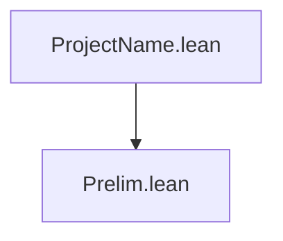

# Dependency Diagram — ProjectName

**Last updated:** 2025-01-01 00:00
**Author**: Your Name

## Project Structure

```
ProjectName/
├── Prelim.lean         # Preliminary definitions
└── _template.lean      # Module template (not imported)
ProjectName.lean        # Root module
```

## Dependency Graph



## Namespace Hierarchy

### 1. **ProjectName.Prelim**

```lean
namespace ProjectName.Prelim
  -- Preliminary definitions
```

## Dependencies by Level

### Level 0: Foundations

- `Prelim.lean` — no dependencies

### Level N: Root

- `ProjectName.lean` — imports all modules

## Exports by Module

### Prelim.lean

```lean
export ProjectName.Prelim (
  -- exported names here
)
```

## Design Notes

1. **Separation of concerns**: each module handles one aspect
2. **Minimal dependencies**: only import what is strictly needed
3. **Selective exports**: only public definitions and theorems are exported
4. **No Mathlib** (unless explicitly required — add to lakefile.lean)

## Verification Commands

```bash
make build          # build full project
make sorry          # check for sorry
make status         # lock status + sorry
```
