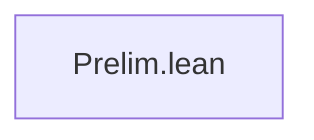

# Technical Reference — ProjectName

**Last updated:** 2025-01-01 00:00
**Author**: Your Name
**Lean version**: v4.28.0

---

## 1. Module Overview

### 1.1 Module Table

| Module | Namespace | Dependencies | Status |
|--------|-----------|--------------|--------|
| `Prelim.lean` | `ProjectName.Prelim` | — | 🔄 In progress |

*Status codes*: ✅ Completo · 🔶 Parcial · 🔄 En progreso · ❌ Pendiente

---

## 2. Dependency Graph



*(Update this diagram as modules are added)*

---

## 3. Module Descriptions

### 3.1 Prelim.lean

**Namespace**: `ProjectName.Prelim`
**Dependencies**: none
**Last updated**: 2025-01-01 00:00
**Status**: 🔄 In progress

Preliminary definitions, notations, and helper infrastructure used by all other modules.

---

## 4. Theorems

### 4.1 Prelim.lean

*(No theorems yet)*

---

## 5. Notations

| Symbol | Definition | Module | Priority |
|--------|-----------|--------|----------|
| *(none yet)* | | | |

---

## 6. Exports

### 6.1 Prelim.lean

```lean
export ProjectName.Prelim (
  -- exported names here
)
```

---

## 7. Documentation Status

### 7.1 Fully Projected Files

*(None yet)*

### 7.2 Partially Projected Files

- `Prelim.lean` — in progress

### 7.3 Notes

*(None)*
